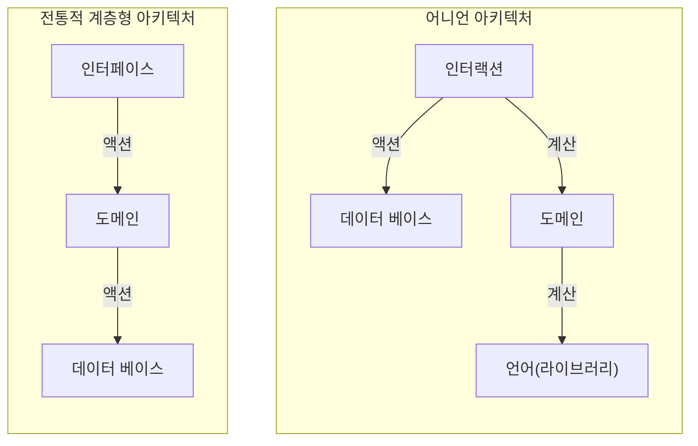

# "쏙쏙 들어오는 함수형 코딩" 책 요약 
“함수형 코딩. 함수형 언어 아님”

함수형 언어를 배우기에는 어려운 개념들이 너무 많다. 하지만 “코딩”으로 범위를 줄여 보면 하나씩 배울만 하다. 함수형 프로그래밍의 세계로 들어가기 전에 기본 개념은 갖추기 위한 쉽고 좋은 설명서이다.

그 전에 우리에게 친숙한 언어(JavaScript)로 구현된 함수형 도구들을 보며, (실제랑 차이는 있겠지만) 어떤 목적으로 어떤 경로를 거쳐 어떻게 만들어 졌는지를 알아가다보면 “함수형”을 쉽게 이해하게 된다. 

Java 개발자의 관점에서 다양한 lambda 표현식이 바로 함수형 도구, 이러한 lambda 표현식이 어떻게 만들어졌는지 상상해 볼 수 있다. (Java Lambda 는 컴파일러가 익명함수로 바꾸는 방식)

이 책에서는 Monad, Curry, 지연평가(lazy evaluation) 등과 같은 다소 고급 활용에 대한 내용을 포함하지 않는다. 

이 책을 다 이해 하였다고 해서 함수형을 모두 알게되는 것은 아니지만, 자신있게 앞으로 더 나아갈 수 있을 것이다.

# 책 내용 정리

실제로 읽어보는 것이 훨씬 구체적이기 때문에 이해하기 쉽다.

## 액션, 계산, 데이터

프로그램 개발 시 액션, 계산, 데이터를 잘 구분하자

- 액션 : 무언가 상태의 변화(= 부수 효과)를 일으키는 작업, 시간/횟수에 영향을 받음
    - Impure function(비순수 함수)
    - 전역 변수 변경, 외부 API 호출, now(), DB 조회, 이메일 전송
    - 액션을 포함한 함수도 액션이 됨
- 계산 : 입력받은 것을 이용하여 결과를 반환하는 작업
    - Pure function(순수 함수)
    - 계산기(같은 입력은 같은 출력), stateless
- 데이터 : 사건(이벤트)에 대한 사실의 기록

함수형 프로그래밍은 ‘계산’이 중심

그러나 실제 프로젝트에서는 액션이 반드시 필요함 → 함수형 코딩을 통해 함수형 프로그래밍의 장점을 취하자

즉, 액션에서 계산을 분리하자 - 계산은 재사용 및 테스트 하기 쉽다

## 불변성 유지

전역 변수, 참조, 데이터 베이스 같은 데이터는 액션에 의해 바뀌게되고 이는 부수 효과를 일으킬 수 있다

액션을 계산으로 바꾸자

- 데이터를 읽어오는 것은 계산, 데이터를 바꾸는 것은 액션
- 데이터 변경도 계산으로 바꿀 방법?
    - Copy-on-write(이하 카피-온-라이트)
    - 원본은 유지하고 복제해서 바꾸자 - 복제할 땐 shallow copy, 바꿀 부분만 new
    - a 에 1 을 더하는게 아니라 a 에 1 을 더한 값을 ‘읽어’오자
    - 함수형 언어는 기본으로 지원하지만, 그렇지 않은 언어는 추가 구현(라이브러리) 필요
- 레거시나 신뢰할 수 없는 코드에서 불변성 지키기
    - 방어적 복사(Defensive copy)
    - 가져올 땐 deep copy 해서 가져오고, 반환 할 때도 deep copy 해서 주기 → 내 코드가 다른 코드에 영향(부수 효과)을 주지 않음 → 계산
    - 약간 높은 비용 발생
    - 신뢰할 수 없는 코드의 데이터를 바꾸지 않음
    - 내 데이터도 신뢰할 수 없는 코드가 바꿀 수 없음

데이터를 바꾸지 않음으로 액션도 계산이 될 수 있음

## 계층형 설계

깨끗한 코드를 위해 계층형으로 설계하는 패턴

- 직접 구현 : 함수간의 호출 계층을 살펴보고 호출 깊이가 비슷해지도록 정리
    - 비즈니스 규칙, 기본 동작, 카피-온-라이트, 프로그래밍 언어 등(결이 같은 것)으로 계층화
    - 위나 옆으로 호출 금지, 가급적 한 단계 아래만 호출
    - 중복 코드가 제거됨(= 재사용)
- 추상화 벽(abstraction barrier) : 일종의 API나 라이브러리 개념
    - 아래 계층이 변경되어도 상위 계층엔 영향 없도록 특정 계층에서 느슨하게 분리
    - 추상화의 벽을 가로지르는 호출이 없어야 함
    - 팀 간의 R&R(책임과 역할)이 분리됨
- 작은 인터페이스 : 인터페이스의 기능은 작고 개수는 적게
    - 위 계층 구현 시 아래 계층을 수정하지 않도록 잘 구현하고, 이를 잘 조합 하자
    - 계층별 역할에 충실
- 편리한 계층 : 위 세가지를 지키면 좋지만, 상황에 따라 유도리있게 만들자(설계 자체가 목적이 아님)

계층적으로 분리하여 유지보수, 테스트를 쉽게 하자

- 위 계층 - 많은 것을 참조하며 자주 바뀜
- 아래 계층 - 자주 쓰이지만 잘 변하지 않음 → 테스트는 아래 계층 부터, 재사용성을 높이려면 아래로
- 전체를 커버하는 테스트 보다 단위를 테스트 하는게 테스트도 쉽고 관리도 용이함(테스트 코드가 낡지 않음)

## 함수형 도구

함수형 코딩을 위한 도구들이 어떻게 도출되어 추상화되었는지 단계별로 따라가면서 함수형 프로그래밍에 익숙해지자

- 일급(first-class) : 변수로 정의하거나 함수로 전달/반환 받을 수 있는 것
- 일급 함수 : 일급이 된 함수
- 고차 함수(higher-order function) : 일급 함수를 인자로 받거나 반환하는 함수
- 콜백(call-back) - 인자로 넘기는 함수, 핸들러 함수, 함수형 언어에서는 별다른 이름이 없음
- 데이터 지향 : 일반 데이터 구조를 그대로 활용하기 - index 로 순회하는 것이 아닌 데이터 그대로 순회

절차형으로 구현된 반복 사용되는 문법(try-catch, for-loop 등)을 일급 함수와 고차 함수로 만들 수 있다

리펙터링 2가지

- 암묵적 인자 드러내기(Express implicit argument)
    - 함수명의 암묵적 인자 찾기
    - 일반적인 이름으로 함수명 변경 & 명시적 인자로 전달
- 함수 본문을 콜백으로 바꾸기(Replace body with callback)
    - 차별화 된 함수 로직을 일급 함수로 추출하여 콜백 인자로 만듦
    - 반복되는 공통 로직을 고차 함수로 만들어 콜백을 처리, 또는 처리하는 함수를 반환

유사한 코드가 반복되고(= 코드 냄새) 있다면 위 2단계의 리팩터링을 거쳐(필요하다면 여러번 반복) 함수형 도구로 뽑아 내자

예제로 보면 이해가 쉬움

```jsx
var users = [ ... ];

// 절차적 코드 (아래와 유사한 코드가 잔뜩 있음을 가정)
function getAllUserIds() { // 암묵적 인자 user
  var userIds = [];
  for(var i = 0; i < users.length; i++) {
    var user = users[i];
    var userId = user.id;
    userIds.push(userId);
  }
  return userIds;
}
function getAllProductIds() { ... }

// 내부 로직은 일급 함수로 추출
function getId(item) { // user 대신 일반화 가능
  return item.id;
}

// for-loop 를 사용하는 여러 유사한 코드에서 암묵적 인자를 array 라는 명시적 인자로 바꿈
// for 구문을 일반화하고, 일급 함수를 받는 고차 함수로 만듦
function forEach(array, f) { // f 는 일급 함수로 추출된 콜백 
  for(var i = 0; i < array.length; i++) {
    var item = array[i];
    f(item);
  }
}

// forEach 를 재사용하여 배열을 일괄 변환시키는 로직을 도구로 만듦
function map(array, f) {
  var newArray = [];
  forEach(array, function(element) {
    newArray.push(f(element)); // 카피-온-라이트로 새로운 객체 생성
  });
  return newArray;
}

// 함수형 도구를 사용한 개선된 코드 예제
var userIds = map(users, getId); // 콜백 전달
```

반복문을 함수형 반복으로

- 단순 반복문 → 리팩터링 → 반복문 안에 수행되는 로직을 일급 함수로 전달 = 고차 함수 → forEach()
- 반복문을 이용해 동일한 로직을 수행하여 반환 → 변환 로직을 콜백으로 전달 → map()
- 반복문을 이용해 특정 조건을 통과하는 것만 반환 → 조건문을 콜백으로 전달 → filter()
- 초기값을 기반으로 하나의 값으로 취합 → reduce() : reduce 로 map 과 filter 구현 가능

스트림 결합(stream fusion) : 카피-온-라이트가 반복되면 메모리 낭비(큰 문제는 아님), 이를 체인으로 최적화, 보통 “점(.) 연산자”를 활용 → 파이프라인으로 직관적 이해

체인화(Chaining)

- 콜백을 익명 함수(인라인 함수)로 구현하는 것 보다 이름을 지어주는게  체인을 명확히 할 수 있음
- 데이터 생성(인덱스가 데이터 자체이면 range() 사용) : 데이터 지향 → 단계별로 쪼개어 수행 → 배열 전체를 순회하며 map, filter, reduce 등 함수형 도구 사용
- 작업 절차를 데이터화 하여 절차대로 순회 혹은 재현 가능(event sourcing)

객체를 다루는 고차 함수

배열이 아닌 객체를 카피-온-라이트로 변경할 수 있는 함수형 도구

- 평범한 객체 수정 로직도 리펙터링하여 고차 함수로 변경, 인자를 데이터로, 변경 로직을 콜백으로 전달 → update()
- 중첩된(nested) 객체는 update()를 재귀 형태로 반복하여 해결 → nestedUpdate()

## 타임라인

액션(= 외부의 변화 유발)으로 구성된 기능은 동시성으로 인한 타이밍 이슈가 발생할 수 있고, 타이밍 이슈는 디버깅이 어렵기 때문에 타임라인으로 분석하자

타임라인 그리기

1. 액션 확인 - 계산은 제외
2. 액션을 그리기
    1. 콜백이나 새로운 큐(Queue)에서 실행될 경우 타임라인 분리
    2. 공유 자원이 있으면 표시하기
3. 단순화 하기
    1. 액션 통합 - 하나의 타임라인 안의 모든 액션은 (순서대로 수행되므로) 통합 
    2. 타임라인 통합 - 타임라인이 끝나는 곳에서 새 타임라인이 ‘하나만’ 생긴다면 통합

타임라인 분석하기

- 타임라인 간 병렬로 공유되는 자원은 문제를 일으킬 수 있음
    - 물리적 이유 등으로 명백히 괜찮은지 확인
    - 가능하다면 공유되지 않도록 지역 변수로 치환(but, 지역변수라도 여러 콜백에서 호출될 경우 동시성 문제가 생길 수 있음)
    - 자원 공유 액션을 콜백(일급)으로 분리하여 새로운 큐(타임라인)에서 실행되게 변경
    - 다양한 자원 공유 도구(큐, 락 등) 사용
- 타임라인 간 병렬로 수행되는 액션은 순서가 섞일 수 있음 (ex: A,B 일때 3가지 가능성,  AB동시 | A→B | B→A)
    - 순서가 섞여도 괜찮으면 OK
    - 순서가 유지되어야 한다면 한 타임라인으로 뭉쳐 순차 처리해야 함 (Queue 등 이용)
    - 병렬로 수행되어야 한다면 Cut 을 이용해 서로가 끝날때 까지 대기

암묵적 시간 모델을 명시적 시간 모델로 바꾸기

- 실행 순서(= 시간 모델)를 명시적으로 표현하자
- Queue, Cut, JustOnce 등 실행 순서를 명확하게 해줄 고차 함수(일급)를 사용 → 동시성 기본형(Concurrency Primitive)

좋은 타임라인 만들기

타임라인은 간단할(= 적고, 짧고, 공유하지 않을)수록 이해가 쉬워 분석하기 좋다

- 타임라인 수 줄이기 - 비동기 호출을 줄이기
- 타임라인 길이 줄이기 - 액션을 계산으로 만들기
- 공유 자원 없애기
- 불가피할 경우 - 동시성 기본형으로 안전하게 자원 공유, 순서 조율

## 반응형/어니언 아키텍처

반응형 아키텍처는 원인과 효과의 중심점을 기준으로 결합도를 줄이는 것

- 기존의 순차적으로 수행되는 로직 : A 가 수행되고 A 는 B 를 호출, B 가 수행되고 B 는 C 를 호출 …
- 반응형 아키텍처 : A 가 수행됨, B 는 A 가 완료되면 수행됨, C 는 B 가 완료되면 수행됨
    - 호출 되어야할 콜백들을 등록하는 것 → 이벤트의 전파 : 파이프라인
    - Callback, Event Handler, Watcher, Listener, Observer 등으로 불림
    - 원인과 효과의 중심점이 있을 경우 유리
- 원인과 효과를 분리 : n * m 개의 액션이 만들어지는 것을 n + m 개로 줄이자
- 유연한 타임라인, 다소 가독성 저하

어니언 아키텍처는 액션에서 계산을 분리하듯, 전통적 계층형 아키텍처에서 인터랙션을 분리



- 기존의 계층형 아키텍처는 가장 바깥의 인터페이스 계층이 도메인 계층을 호출, 도메인 계층에서 DB 를 접근(액션) → 액션의 전파로 모두 액션이 됨
- 어니언 아키텍처 : 사용자의 입력, DB 호출, 외부 API 연결 등 액션이 일어나는 계층을 인터랙션 계층으로 분리
    - 인터랙션 계층에서 사용자 입력을 받은 뒤 필요한 데이터를 획득하여 도메인 계층의 계산을 이용
    - 도메인 계층은 대부분 비즈니스 규칙(계산)으로 구성 - 재사용과 테스트가 용이해짐

이러한 구조가 완벽한 도구는 아니므로 상황과 과제에 맞게 적절하게 활용하자

- 도메인 용어를 사용한다면 도메인 계층으로, 아니라면 인터랙션 계층 → DDD?
- 가독성과 개발속도, 시스템 성능을 고려

## 함수형 프로그래밍

앞으로 나아가기

- 열정이 있는 동안 안전한 곳에서 연습,  한계를 깨달았을 때 제품에 적용하며 성장

내 과제에 함수형을 적용할 방법

- 샌드박스(사이드 프로젝트, 연습 문제) →  제품(버그 수정, 일부만 개선)

수학적 지식 얻기

- 람다 대수, 콤비네이터, 타입 이론, 카테고리 이론, 이펙트 시스템(모나드, 펑터) 등…