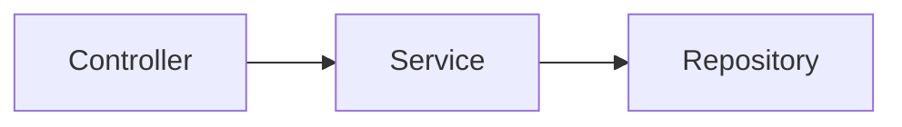
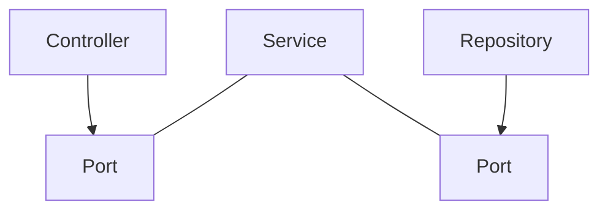
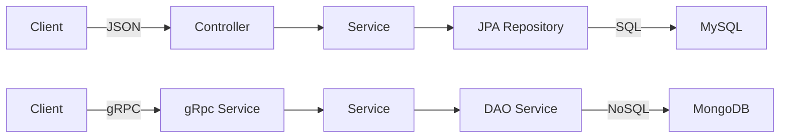

# Hexagonal Architecture 는 우리를 구해줄 수 있을까?

많은 이들의 관심을 끌고 있는 hexagonal architecture(이하 육각형 아키텍처)의 자료를 찾아보았다. 이는 지금껏 수많은 서비스들을 개발하면서 느꼈던 좌절과 분노를 극복하도록 도와줄 수 있을까? 아니면 그저 유행처럼 지나가 버릴까?

육각형 아키텍처에 대한 많은 글을 읽어봤지만 완벽히 이해되지 않은 부분을 질문과 답변 형식으로 정리해 보았다.

# 개요

본격적으로 Clean Architecture(이하 클린 아키텍처) 와 육각형 아키텍처에 대해 정리하기 전에 아래 영상들을 보면 이해에 도움이 될 것이다.

- 컨셉 (10분) : [https://www.youtube.com/watch?v=MKfSLrwLex8](https://www.google.com/url?q=https://www.youtube.com/watch?v%3DMKfSLrwLex8&sa=D&source=calendar&ust=1676947297959190&usg=AOvVaw1Fcg1VBpY580EfV0DyDsDy)
- Clean Architecture (42분) : [https://www.youtube.com/watch?v=g6Tg6_qpIVc](https://www.google.com/url?q=https://www.youtube.com/watch?v%3Dg6Tg6_qpIVc&sa=D&source=calendar&ust=1676947297959190&usg=AOvVaw0X4GxgdgcrVLpwh0ojTSf-)
- DDD (16분) : [https://www.youtube.com/watch?v=4QHvTeeTsj0](https://www.google.com/url?q=https://www.youtube.com/watch?v%3D4QHvTeeTsj0&sa=D&source=calendar&ust=1676947297959190&usg=AOvVaw0OUHjOvd6zkcAPjnur3AaJ)

## 요약

수십 년간 개발하면서 느낀 좋은 아키텍처의 공통점, 법칙을 정리 → 클린 아키텍처

클린 아키텍처의 방법론 → 육각형 아키텍처 : 규칙을 지키다 보면 클린 아키텍처가 된다.

## 좋은 아키텍처란?

여기서는 기능 추가 및 수정이 쉬워 유지보수 비용(개발자 수, 개발 기간 등)을 절감할 수 있는 아키텍처를 말한다.

단, 가장 좋은 아키텍처는 ‘당신의 과제에 맞는’ 아키텍처이므로 만능은 아니라는 대전제를 깔고 있다.

## 전통적인 아키텍처

비즈니스에서 인프라 쪽으로, 상위 레이어에서 하위 레이어로 참조(의존성)가 한 방향으로 흐르는 것.

전통적인 아키텍처의 문제점은 의존성의 방향에 의해 DB 구조(인프라)에 의해 비즈니스 로직이 결정될 수 있다는 점과 시스템의 규모가 커졌을 때 유지보수가 힘들어진다는 점이 있다.

## 육각형 아키텍처

비즈니스(도메인)이 가장 중요하고 인터페이스나 인프라는 중요성이 낮아 참조 방향이 가운데로 집중되는 것.

(Mermaid 로 그려 좀 이상하지만) 외부 통신과 내부 비즈니스 로직은 분리되어 있다. 상세 그림은 [https://reflectoring.io/spring-hexagonal](https://reflectoring.io/spring-hexagonal/) 에서 확인.

# 의문

## 누가 만들었나?

클린 아키텍처는 Robert C. Martin 에 의해 2017년에 제안됨

육각형 아키텍처는 Alistair Cockburn 에 의해 2005년 제안됨

- 출처: [https://alistair.cockburn.us/hexagonal-architecture/](https://alistair.cockburn.us/hexagonal-architecture/)
- [https://blog.funhnc.com/entry/육각형-아키텍처Hexagonal-architecture](https://blog.funhnc.com/entry/%EC%9C%A1%EA%B0%81%ED%98%95-%EC%95%84%ED%82%A4%ED%85%8D%EC%B2%98Hexagonal-architecture) (번역)

클린 아키텍처 중의 하나가 육각형 아키텍처 인줄 알았지만, 사실 그 동안 여러 개발자들에 의해 제시되던 다양한 법칙, 방법론 들을 정리한 것이 클린 아키텍처이다.
엄밀히 말하면 ‘깨끗한’ 아키텍처에 대해 논의된 건 수십 년 전부터이지만 Clean Architecture™ 으로 최근에 정리된 것!

이외에도 Onion Architecture, Lean Architecture 등이 있다.

- 참조: [https://blog.cleancoder.com/uncle-bob/2012/08/13/the-clean-architecture.html](https://blog.cleancoder.com/uncle-bob/2012/08/13/the-clean-architecture.html)

## 왜 “육각형” 인가?

육각이기 때문에 6이랑 무슨 관련이 있는 것 같았지만, 6 자체에는 의미가 없고 6각형 모양의 이미지에서 유래

> 육각형은 시각적으로 강조하기 위한 것입니다.
(a) 내부-외부 비대칭 및 포트의 유사한 특성을 시각적으로 강조하여 1차원 레이어드 그림과 모든 것을 연상시키는 것에서 벗어나고,
(b) 2개, 3개, 4개 등 정해진 수의 서로 다른 포트가 존재한다는 점(지금까지 제가 경험한 포트는 4개가 가장 많았습니다.)
육각형은 숫자 6이 중요해서 육각형이 아니라, 그림을 그리는 사람들이 1차원적인 레이어 그림에 제약을 받지 않고 필요에 따라 포트와 어댑터를 삽입할 수 있는 공간을 확보하기 위한 육각형입니다. 
'육각형 아키텍처'라는 용어는 이러한 **시각적 효과에서 유래**했습니다.
> 
- 출처 : [https://en.wikipedia.org/wiki/Hexagonal_architecture_(software)#Origin](https://en.wikipedia.org/wiki/Hexagonal_architecture_(software)#Origin)

## 포트와 어댑터?

육각형 아키텍처의 다른 이름은 포트와 어댑터 패턴.

육각형 아키텍처의 목표는 도메인의 모든 외부(바깥쪽) 연결은 포트로 정의하고, 바꿔 끼울 수 있는 것들은 어댑터로 구현하여 느슨한 연결로 시스템을 구성하는 것이다.

- 포트는 항상 유지되어야 할 스펙
- 어댑터는 변경을 호환시켜 줄 기술

기존의 전통적 아키텍처(Spring MVC)의 데이터의 흐름에 비유한다면,

여기서 변치 않는 도메인 영역을 Service 라 볼 수 있고, Controller 와 Service 사이에 존재할 interface 를 포트, Controller 를 어댑터로 볼 수 있다. 그리고 Service 와 JPA Repository 사이 역시 포트이고 JPA 가 구현하여 주입할 구현체가 어댑터가 된다.

이 Controller 와 JPA Repository 를 gRPC Service 나 DAO Service 로 (adapter 를)교체하면 외부 인프라스트럭쳐를 Service 변경 없이 갈아 끼울 수 있게 된다.

참조: [https://engineering.linecorp.com/ko/blog/port-and-adapter-architecture/](https://engineering.linecorp.com/ko/blog/port-and-adapter-architecture/)

### 주포트와 부포트?

도식에서 포트는 안쪽 어댑터는 바깥쪽으로 그려져 있지만, 사실 좌우에 따라 역할이 다름

- 주포트(Primary, Driving)는 application 이 사용되는 부분으로 포트만 제공하면 사용하는 측에서 이에 맞게 어댑터를 구현해야 한다.
- 부포트(Secondary, Driven)는 application 이 사용할 부분으로 포트로 정의해 두고, 제공하는 측에서 이에 대한 구현체를 주입(의존성 역전)해야 한다.

이렇게 주/부 간에 구현 방법이 다른 이유는 데이터의 흐름은 여전히 전통적 아키텍처처럼 상위 레이어에서 하위 레이어로 흐르지만, 의존성은 끊기 위한 요령인 것이다.

## 스프링의 DI 와 관계?

육각형 아키텍처의 부포트에 의존성을 주입하기 위해 스프링을 쓸 수 있다. 즉, 육각형 아키텍처를 구현하기 위해 의존성을 주입해야 하고, 스프링은 의존성 주입을 위한 여러 방법의 하나인 것이다. (주의, DI 는 스프링만이 제공하는게 아님)

Hexagonal Architecture 는 쉽게 외부를 바꿔 끼울 수 있어야 하고, 스프링의 IoC, DI 도 느슨한 결합을 위한 것이므로 둘의 목표가 같다.

## DDD 는 무슨 관계?

관심사의 분리 - 결국 도메인과 인프라가 관심사의 차이에 의해 분리된다.

높은 응집도, 낮은 결합도 - 관계가 깊은 것끼리 모으고, 무관한 것은 분리한다. 낮은 관계는 느슨하게 연결한다.

단일 책임 법칙 - 도메인이 바뀌는 것은 요구사항이 바뀔 때 뿐.

인프라가 변하더라도 도메인은 변하지 않는 아키텍처 → 이것이 결국 DDD!

육각형 아키텍처가 DDD 는 아니지만, DDD 를 구현하기에는 육각형 아키텍처가 적합해 보인다.

- 참조: [https://reflectoring.io/spring-hexagonal/](https://reflectoring.io/spring-hexagonal/)
- [https://dataportal.kr/74](https://dataportal.kr/74)
- [https://happycloud-lee.tistory.com/94](https://happycloud-lee.tistory.com/94)

## 필요한 구간별 DTO

육각형 아키텍처를 사용하면 도메인과 인프라를 분리하기 위해 많은 interface 와 DTO 가 생긴다. 또한 이들을 같은 도메인끼리 분류하기 때문에 많은 패키지가 생긴다.

DTO 는 구간이 바뀌더라도 (DB 의 Entity 가 Controller 의 Response 까지) 변하지 않는 경우가 많은데, 그렇더라도 분리하여야 한다. 그냥 쓰게 되면 시나브로 영속성(DB scheme)에 종속되게 된다고 한다.

이 부분은 다소 모호한 영역으로 개발자의 경험과 팀원과의 합의로 정해져야 할 것으로 보인다.

- Controller  : JSON 으로 serialize
- UseCase/Port : DTO 로 통신
- Service (Application/Domain) : VO 또는 Domain Entity 를 이용해 비즈니스 로직 구현
- 외부 서비스나 DB : Entity

# 결론

- 토막토막 끊어져 있어 테스트, 유지보수, 확장에 용이하다.
- 거창한 이름과 달리 적용하기 어렵지 않다 - 다만 공감과 합의가 필요할 뿐
- 도메인(비즈니스 로직)에 집중하는 것은 시대의 흐름 - 인프라(하위) 레이어는 언제나 바뀔 수 있다.
- DDD 를 적용할 필요는 없지만, 만들다 보면 DDD 스럽게 될 것이다.

## 개인적인 생각은…

모던 아키텍처 - MSA, 함수형 패러다임, 클라우드 인프라와 컨테이너, DevOps(SRE)… 이 모든 흐름이 한 가지 경향을 띠고 있다 → 비즈니스에 집중하라!

# 참조

- 만들면서 배우는 헥사고날 아키텍처 정리: [https://injae7034.github.io/java/wooa_study_01/](https://injae7034.github.io/java/wooa_study_01/)

# 추가 자료

## Clean Architecture : 클린 아키텍처 애매한 부분 정해 드립니다.

NHN FORWARD 22 자료  
[https://www.youtube.com/watch?v=g6Tg6_qpIVc](https://www.youtube.com/watch?v=g6Tg6_qpIVc)

### 소프트웨어 아키텍처?

- 소프트웨어가 제공하는 가치 = 구조와 기능(보통 기능에 집중, but 구조가 더 중요)
- 우리가 추구해야 할 코드는 물건(기능)이 많더라도 더럽지 않고 어느 정도 정리가 되어있어 새로운 물건을 놓기 쉬운 상태이자 구조 (물건이 별로 없으면 깨끗하지만 이는 우리의 목표가 아님)
- 아키텍처는 구조

### 우리가 회사에서 하는 일

- 유지보수 : 컴퓨터에게 일을 더 정확히(디버깅) / 더 빠르게(성능개선) / 더 많이(기능추가) 시키기 위한 작업 → 코드를 읽고 이해하고 수정하는 일 = 구조가 중요
- 기능은 구조에 의지한다
- 구조가 좋으면 기능은 향후 추가하면 됨(구조가 나쁘면 곧 버려지게 됨)

### 좋은 아키텍처?

- 코드를 이해하고 변경하기 쉽게!
- 패러다임/설계원칙(SOLID)/응집성/결합
- 아키텍처 패턴을 쓰자! - 원칙은 저절로 지켜지거나 지켜지게 쉽게 만들어 줌

### 패턴

- 계층형(전통적) - 단순/익숙, 쉬움 vs 도메인에 무의미(무관), 커지면 복잡, 조직화 불가, DB 구조가 영향을 줌
: 기능에 중점
- 클린(도메인 중심) - 규칙단순, DDD 용이, 비즈니스에 집중 vs 패키지가 복잡, 생소 
: 의존성 역전 이용

### 클린 아키텍처

- 공통 규칙 : 관심사의 분리,
- 공통 핵심 규칙 : 중요도에 따라 계층 분리하고 의존성 방향은 고수준을 향함
- “클린 아키텍처” 책은 바이블로 수많은 원칙과 실천법 소개 - 다이어그램 하나로 해결 안됨
- “만들면서 배우는 클린 아키텍처” 책은 실천서, 헥사고날 소개

### 헥사고날 아키텍처

- 계층형
    - 기존의 Controller - Service - Repository 처럼 계층을 수평으로 분리
- 기능기반
    - 연관된 기능(도메인)에 따라 수직으로 조각
    - 도메인에 따라 분리, 변경 대상을 확인하기 쉬움 vs 계층구조 분리 안됨
- 헥사고날(포트 & 어댑터)
    - 수직/수평으로 나눔, DB 계층의 의존성 역전
    - 도메인 중심, 구조적 vs 복잡한 패키지(패키지가 4배 정도로 증가, 방 정리 때 수납가구를 들여놓는 일)

### 애매한 점

- 규칙이 너무 단순, 핵심 규칙 2가지 외에는 케바케
- 그렇다면 기준을 세우자
    - 개발과 유지보수 비용 최소화
    - 코드 의존성은 고수준으로 향하게
    - 세부사항 변경에도 도메인은 변동 없이
    - 쉬운 테스트
    - 각각의 원칙을 지키자
- 부적합한 프로젝트
    - 소규모
    - 개발자 모두의 이해와 공감이 없거나 합의되지 않았을 때
- 진행 시 합의 필요
    - 코드만이 아니라 패키지 구조가 바뀜
    - 다른 개발자(후임자)가 이해 못하거나 불평할 수 있음
- 꼭 다 지켜야 하나?
    - 알아서 적당히 잘 조심스럽게, 알잘딱깔센
    - 지름길 자제 - 돌아올 지점 표시(주석), 정석으로 못 돌아올 수도 있음
- Entity(DTO) 는 굳이 분리해야 하나?
    - 안하면 결국 DB에 의존이 되어 계층형이 됨 → 개발 시 DB 를 먼저 고민하게 됨
    - 분리하여 비즈니스에 집중
- JPA Repository 는 무엇이 되나?
    - 출력 포트 한 번의 호출로 해결이 되도록 분리
    - JpaRepository 를 의존하는 Adapter 생성, Adapter 로 의존성 역전
- 다른 도메인(컴포넌트)를 호출해야 할 때?
    - 같은 레이어에서는 괜찮음(= 의존성이 생기지 않게), 역방향 참조 / 순환 참조 / 강결합되지 않도록 주의
- 유즈케이스를 꼭 인터페이스로 분리?
    - 레이어간 서로를 잘 알지 못하게 선(사고의 경계)을 그어주자
    - 안 중요한 레이어라도 규칙 적용
    - 인터페이스는 API 의 spec! (Spec 정의 → 세부사항 구현)

### 결론

- 아키텍처는 중요, 좋은 아키텍처 중 하나인 클린 아키텍처, 그런데 애매하다, 기준을 갖고 가자