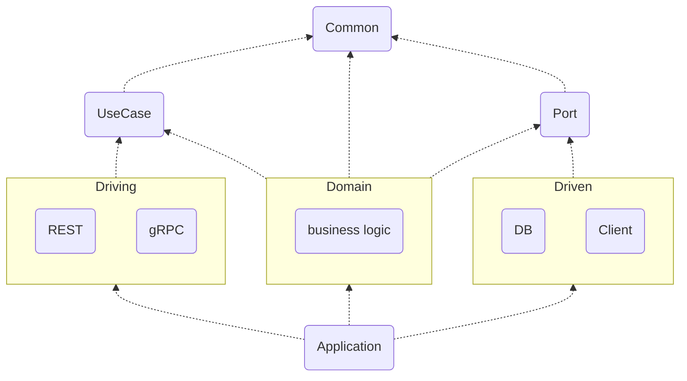

Hexagonal Architecture 를 기반으로 구현을 하며 선택한 결정들과 마주했던 고민들   

# 개요

외부 의존성을 최대한 낮추고 비즈니스 로직에 집중하기 위해 Hexagonal Architecture 를 도입하였고, 이를 구현하기 위한 구조를 만들기 위해 많은 노력을 하였다. 그 과정에서 생겼던 실질적인 고민(모듈과 패키지 구조, DTO 구현 방법)을 정리하였다.

- 예제 코드 : [https://github.com/mystria/project-blog-search](https://github.com/mystria/project-blog-search)
- 참고로 예제 코드의 모듈명은 본문과 약간 다름 (합의를 통해 달라질 수 있는 부분)
    - driving → web
    - driven → infra
    - application → bootstrap

# Module 계층 관리

Hexagonal Architecture 를 구현하기 위한 모듈 구조는 정해진 답이 없으며 조직의 합의를 따른다. 모듈 구조와 관련된 내용들은 인터넷에 정리되어 있거나 GitHub 에 예시들이 존재하지만, 결국 그걸 수용하는 입장에서 팀원들간 이해가 원활한 방향으로(개발자의 멘탈 모델?에 맞게) 결정해야 한다.

모듈 이름부터 합의를 통해 정하지 않으면 개발 의사소통이 힘들기 때문에 심혈을 기울이자.

## 전체 구조

각 모듈은 각자의 빌드 설정(build.gradle)을 가지고 있어 모듈 간의 라이브러리를 공유하지 않는다. 다만 라이브러리 정의는 [buildSrc 에 정의한 gradle 설정](https://docs.gradle.org/current/userguide/organizing_gradle_projects.html#sec:build_sources)(conventions)을 따르므로 결과적으로 동일한 라이브러리를 참조하게 된다. 즉, 같은 의존성을 가지고 있지만 이를 공유하진 않기 때문에 안정적으로 빌드가 유지될 수 있고, 의존성 충돌 문제도 최소화 할 수 있다.

각 모듈간의 의존성은 아래 Module Structure diagram 을 참조한다.

# 도메인 모듈

## UseCase & Port

Domain 계층과 Adapter 계층이 만나는 UseCase 와 Port 들을 제공, Domain 에 존재해도 되지만 의존성이 구현체를 참조하지 못하도록 강제하기 위해 모듈로 분리

Inbound Port 는 UseCase 라는 postfix 를 사용 / Outbound Port 는 Port 라는 postfix 를 사용한다.

각각은 UseCase 모듈과 Port 모듈에 위치하며 다양한 이름으로 불릴 수 있다. (Driving / Driver / Primary / Inbound / In / Input) 와 (Driven / Secondary / Outbound / Out / Output)

인터페이스를 위해 사용할 DTO 도 이 계층에 정의한다.

## Driving (Primary/Driving Adapter)

gRPC, REST 등으로 입력이 들어오는 모듈

Controller 또는 RouterFunction 은 Driving Adapter 로 써 UseCase 를 통해 Domain 을 호출한다.

## Domain (Application / Domain)

Domain 언어로만 정의된 비즈니스 로직의 집합

Service 는 UseCase 의 구현체, Dependency Injection 으로 UseCase 에 주입된다. Service 는 Port 를 사용한다.

Domain 에서 사용하는 객체들은 도메인 모델 패턴으로써 객체 내에 비즈니스 로직을 포함하고 있다. (참고로 Domain Driven Design(DDD) 에서는 Domain Model 을 Aggregate 로 정의할 수 있다.) 또한 Service 에서 트랜잭션 스크립트 패턴으로 구현 할 수 있다. 즉, 주요 로직은 Service 와 Domain Model 에서 구현된다.

## Driven (Secondary/Driven Adapter)

DB, Cache, 외부 서비스 등을 연결하거나 구현하는 모듈

Adapter 는 Port 의 구현체이며 Driven Adapter 이다. Dependency Injection 으로 Port 에 주입된다.

DB 패키지의 adapter 에서는 JPA 트랜잭션을 구현하거나 Repository 에 위임하여 (@Transactional annotation) DB 단위 트랜잭션을 담당한다. 영속성 컨텍스트가 Domain 까지 영향을 줄지에 대해서는 논의가 필요할 수 있으나, 느슨한 의존성을 위해서 Driven 모듈에서 해결하는 것이 좋다.

# 기타 모듈

## Common

공통의 기능이나 객체를 담당하는 모듈

Util 이나 Enum 등, 도메인 전반에 걸쳐 (거의)불변하며 일반적인 역할을 수행할 객체를 담당한다. Driving, Domain, Driven 에서 참조하여 공통으로 사용할 수 있다.

만약 Driving 에서 Driven 까지 전달되어야 하는 도메인 외적인 정보, tracking ID 나 context 등이 존재한다면 Common 을 통해 전파하도록 한다.

## Application

서비스가 수행되는 framework 를 관리하고 build 시 artifact 를 생성하는 모듈

서비스 공통의 기술적인 설정(프레임워크: Spring Framework)을 관리한다. Driving, Domain, Driven 를 통합하여 수행하는 Main Application 이 존재하고, 이를 통해 하나의 build 파일을 만들고 배포한다.

공통된 프레임워크 환경을 제공하여 생산성을 높이고 유지보수를 쉽게하기 위함으로, 서비스가 여러개로 늘어날 경우 Common 과 Application 모듈을 skeleton 으로 공유하거나, Repo 안에서 모듈 조합으로 서비스를 n 개로 배포할(≒ MonoRepo) 수 있다.

각 모듈의 역할을 명확하게 분리하여 도메인에만 집중하게 하고, Application 모듈은 언제든지 프레임워크 까지 교체할 수 있는 아키텍처를 제공한다.

# Package 계층 관리

## 초기 설계 방향

Domain 모듈은 도메인 언어로 정의되어 있으며 응집성을 위해 같은 도메인 모델들은 한 패키지로 모은다. 이에 대응하는 adapter 들도 이 구조와 동일하게 구성한다.

기존 Controller - Service - Repository 같은 계층형 구조에서는 Controller 패키지와 Service 패키지, Repository 패키지로 구분했지만, Hexagonal Architecture 에서는 Controller 는 Driving 모듈에 존재하고, Service는 Domain 모듈, Repository 는 Driven 모듈에 존재한다.

즉, 계층(Layer)으로 패키지를 나눌 필요가 없이 도메인으로 나눌 수 있는 것이다.

### AS-IS

- Layer - Domain 으로 구분
- 예 : 모듈은 하나이고 계층에 따라 패키지를 분리
    - 단일 모듈 > com.mys.controller > UserController.java
    - 단일 모듈 > com.mys.controller > CompanyController.java
    - 단일 모듈 > com.mys.service > UserService.java
    - 단일 모듈 > com.mys.service > CompanyService.java

### TO-BE

- Module - Domain 으로 구분
- 예 : 모듈을 구분, 도메인 별로 패키지는 동일
    - Driving > com.mys.user > UserController.java
    - Driving > com.mys.company > CompanyController.java
    - Domain > com.mys.user > UserService.java
    - Domain > com.mys.company > CompanyService.java

## 현실 설계

초기 설계대로 모듈은 다르지만 패키지는 Driving 에서 Driven 까지 도메인 별로 vertical 하게 나누고 싶었으나, 기술적인 관리 때문에 완벽하게 vertical 로 나눌 수가 없었다. 결국 모듈 아래에 기능별 계층을 두어 전통적인 Module - Layer - Domain 체제를 가져가야 했다.

- 예 : Spring Data 에서 repository 와 entity 를 스캔하기 위해 하나의 package 에 모여 있어야 함 → Domain 단위로 분리 불가
    - Driven > com.mys.db.repository > UserRepository.java
    - Driven > com.mys.db.repository > CompanyRepository.java
    - Driven > com.mys.db.model > UserEntity.java
    - Driven > com.mys.db.model > CompanyEntity.java
- 예 : 도메인 별로 모으더라도 기술적인 계층 분류가 우선시 됨
    - Driven > com.mys.client.grpc.privacy > PrivacyAdapter.java
    - Driven > com.mys.client.grpc.privacy > PrivacyMapper.java
    - Driven > com.mys.client.rest.customer > CustomerAdapter.java
    - Driven > com.mys.client.rest.customer > CustomerFeignClient.java

# DTO 와 Domain Model

## DTO 에 대하여

gRPC 의 protobuf 는 Java 객체를 생성하지만, 우리가 만든 객체를 protobuf 에서 사용할 수는 없기 때문에 gRPC service 의 proto 객체를 UseCase 의 DTO 로 바꿔주어야 한다. 만약 그냥 REST API 였다면 UseCase 의 DTO 를 request 또는 response 로 사용해도 괜찮을 것이다.

JPA 의 entity 는 여러 persistence annotation 이 적용되어 영속성 컨텍스트에 강하게 종속된다. 이를 DTO 로 사용하는 것은 Hexagonal Architecture 의 취지도 벗어나고, 일반적으로도 권장되지 않는다.

UseCase 와 Port 에서 인터페이스에 사용되는 객체가 필요하다.

즉, Protobuf 또는 Request/Response 객체 → UseCase 의 DTO → Domain Model → Port 의 DTO → Entity 또는 Client 객체 와 같이 5단계의 객체가 존재하게 된다. 이렇게 다양한 DTO 는 엄청난 양의 중복 코드를 양성해 내고, 코드의 가독성을 떨어트린다.

## DTO 구현 사례

위 5단계의 객체를 어떻게 다룰지에 대한 다양한 논의들이 존재한다.

- 참고: [https://vaadin.com/blog/ddd-part-3-domain-driven-design-and-the-hexagonal-architecture#_input_and_output](https://vaadin.com/blog/ddd-part-3-domain-driven-design-and-the-hexagonal-architecture#_input_and_output)
    - DTO 없이 직접 객체 사용 : DTO 변환 불필요 but 계층간 강결합
    - DTO 구현 : 유연하고 제어 쉬움 but 많은 중복 코드
    - DPO (Domain Payload Object) : 필요할 경우 DTO 에 도메인 모델 포함 가능(불변값으로 활용, 비즈니스 로직이 없는 모델에 한함)
- DTO 가 구현된 Hexagonal 예제 :
    - [https://github.com/AlmostFamiliar/hexagonal-example](https://github.com/AlmostFamiliar/hexagonal-example)
    - [https://github.com/thombergs/buckpal](https://github.com/thombergs/buckpal) (reflectoring.io 예제)
- DTO 없이 구현된 Hexagonal 예제 :
    - [https://github.com/JonathanM2ndoza/Hexagonal-Architecture-DDD](https://github.com/JonathanM2ndoza/Hexagonal-Architecture-DDD)
    - [https://github.com/AlicanAkkus/Modular-Architecture-Hexagonal-Demo-Project](https://github.com/AlicanAkkus/Modular-Architecture-Hexagonal-Demo-Project)
    - [https://github.com/rdelgatte/spring-hexagonal-example](https://github.com/rdelgatte/spring-hexagonal-example)

## 검토

위의 5단계의 객체에서 Protobuf 또는 Request/Response 객체와 Entity 또는 Client 객체는 각각 Driving 과 Driven 에서만 존재하는 DTO 이므로 도메인 로직과는 독립적인 관계로 봐야 한다.

- Driving 에서는 Protobuf 또는 Request/Response 객체를 적절히 UseCase DTO 로 변환한다.
- Driven 에서는 Port DTO 를 Entity 또는 Client 객체로 변환한다.

즉, 도메인 관점에서 이 양쪽 끝의 DTO 는 블랙박스인 것이다.

남은 것은 UseCase DTO ↔ Domain Model ↔ Port DTO 의 관계이다. 이들을 거의 동일한 구조를 갖고 있기 때문에 변환이 필요한 부분은 많지 않다. 

거의 동일하다면 DTO 없이 도메인 객체를 직접 사용하는 방법은 안될까? 이 방법은 의존성 완화의 목적을 완벽하게 위배하므로 Hexagonal Architecture 를 도입한 의의를 무산시키므로 제외한다.

## 의사 결정

우리의 결론은 Port DTO 를 Domain Model 로 사용하자는 것이다. 다음과 같은 이유를 들 수 있다.

- UseCase DTO 는 주로 요청이며, CQRS(Command Query Responsibility Segregation) 패턴이 될 수 있다. 이는 데이터가 아니다.
- 도메인 계층은 Driving 에서 받은 요청을 기반으로 Driven 에서 얻은 데이터를 가공하거나 Driven 에게 데이터를 전달하는 것이 주업무이다. 다시말해 Driven 과 함께 하는 일이 더 많다.
- Domain 에서 Driven 에게 필요한 형태로 DTO 를 주는 것 보다 Driven 이 직접 Domain Model 을 활용하는 것이 Entity 또는 Client 객체로 변환하기 쉽다.
- Domain Model 을 불변성있게 구현한다면 Driven 에서 Domain Model 을 접근해도 안전하다.

이런 결정은 정답이 아니고 상황에 따라 협의로 정해지는 것이다.

# 결론

이 방법이 옳은지, 정석(?)을 잘 따랐는지는 확신은 못하겠다. 열심히 개발할 때는 맞는 것 같은데, 운영에 올릴 때 되어서야 틀렸음을 깨달을 수도 있다. 그때는 맞고 지금은 틀렸다. 그저 이렇게도 했구나… 참고만 하자.

# 참조

- [https://reflectoring.io/spring-hexagonal/](https://reflectoring.io/spring-hexagonal/)
- [https://github.com/Sairyss/domain-driven-hexagon](https://github.com/Sairyss/domain-driven-hexagon)
- [https://vaadin.com/blog/ddd-part-3-domain-driven-design-and-the-hexagonal-architecture](https://vaadin.com/blog/ddd-part-3-domain-driven-design-and-the-hexagonal-architecture)
- [https://injae7034.github.io/java/wooa_study_06/#%ED%8F%AC%ED%8A%B8-%EC%9D%B8%ED%84%B0%ED%8E%98%EC%9D%B4%EC%8A%A4-%EB%82%98%EB%88%84%EA%B8%B0](https://injae7034.github.io/java/wooa_study_06/#%ED%8F%AC%ED%8A%B8-%EC%9D%B8%ED%84%B0%ED%8E%98%EC%9D%B4%EC%8A%A4-%EB%82%98%EB%88%84%EA%B8%B0)