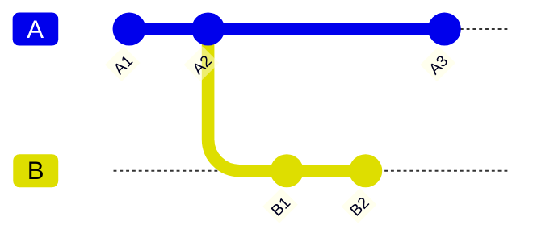
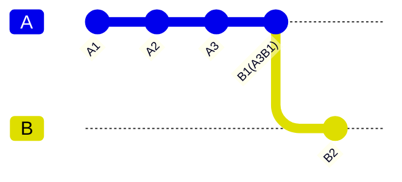
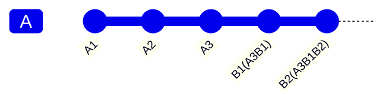
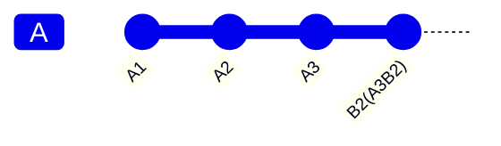
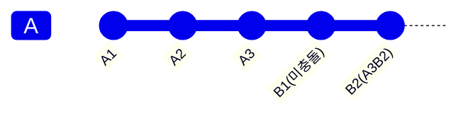
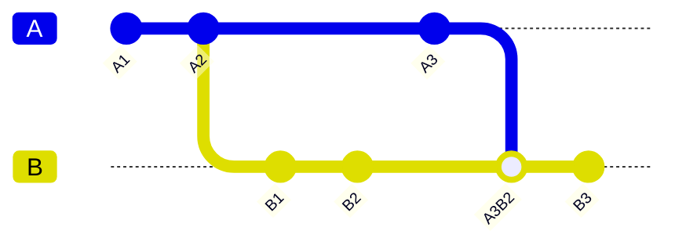
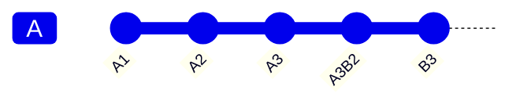
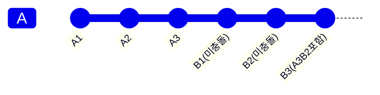

복잡하게 얽힌 git branch 들 중에서 하나의 branch 를 정리하고자 맨 위로 rebase 하게 되면 그 동안 얽혔던 commit 들이 풀리면서 엄청난 충돌(conflict)이 발생한다.

몇 번이나 해결(resolve)을 해도 자꾸 자꾸 충돌이 발생하는데, 오래된 작업이라 어떤게 맞는 코드인지 기억도 가물가물하다.

안전하게 병합(merge)하기 위해서 어떻게 해결을 해야 할까? 원리를 알면 어떻게 해야 할지 실마리도 보인다.

# rebase 병합과 충돌

브랜치 A 와 B 가 있을 때,



B2 를 A3 위로 rebase 할 경우, A3 과 B1 이 충돌한다. 이를 resolve 하면 A3B1 으로 만들어진다.



그러나 A3B1 으로 resolve 하더라도 A3B1 과 B2 가 여전히 다르기 때문에 다시 충돌한다. A3B1 과 B2 를 resolve 하면 A3B1B2 가 만들어지는데, 최종적으로 git 히스토리에는 아래와 같이 만들어진다.



위에 대해 정리하자면,

- rebase 하는 branch(B) 의 commit 개수 만큼 병합이 일어남
- 각 commit 마다 충돌이 있으면 매번 해결 해야함 = 힘듦

# 쉬운 해결 방법

만약 B branch 의 변경 히스토리가 중요하지 않다면? 어차피 병합할 때 squash 할 것이라면? 마지막 commit 만 resolve 하면 되지 않을까?!!
B2 를 A3 위로 rebase 할 때, A3 와 B1 의 충돌은 해결하지 않고 A3 를 선택하면 된다. (만약 여기서 B1 을 선택하면 이 후 충돌은 없겠지만 A3 의 코드를 잃게 되므로 주의)
대신 다음 단계에서 A3(= B1) 와 B2 의 충돌은 해결한다. 마지막 commit 인지 여부는 rebase 하기 전에 commit 의 hash 를 기억해두거나 commit 개수를 외우면(😎) 된다..

이런 작업의 결과는 아래와 같아진다.



B 의 commit들의 히스토리가 사라지지만 복잡한 병합 resolve를 한 번만 하면 되기 때문에 편해진다.

위는 조금 극단적인 예시이고, 사실 B1 은 병합되면서 충돌이 없는 코드들은 남아 있기 때문에 실제 git 히스토리는 아래와 같아진다.



## 사전에 병합한 경우

만약 A3 을 B2 로 먼저 병합해두면 어떨까? rebase 를 하지 않는다면 보통 이 방법을 사용할 것이다.

우선 A3 과 B2 를 병합할 때는 이 둘의 충돌만 발생한다. 이를 해결하면 A3B2 commit 이 생성된다.



이런 상태에서 B branch를 A3 위로 rebase 하면 어떻게 될까? A3B2 다음에 B3 를 하나 더 commit 했다고 가정해보자. 기대하기로는 아래 처럼 깔끔하게 자동 병합되면 좋겠지만…



현실은 위에 한 번 정리했듯이 A3 와 B1, B2, B3 까지 세 번의 충돌이 발생한다🥹. (아마 이런 이유로 rebase 를 꺼리게 될 것이다.) 단, 병합 commit 인 A3B2 는 A3 와 한 번 병합되었기 때문에 skip 되고 B3 conflict으로 넘어간다.

이 경우도 마지막만 해결하는 방법을 선택할 수 있다. 이 경우 결과는 아래와 같아진다.



더 복잡한 상황도 있겠지만 기본적인 원리는 동일하다.

# 정리

- rebase 하는 branch 의 commit 개수 만큼 병합이 일어남
- 각 commit 마다 충돌이 있으면 매번 해결 해야함
- 마지막 commit 만 해결하는 방법으로 충돌 해결 노력을 줄일 수 있음

## 추가

병합 과정에서 잃어버린 것이 없는 지 확인하는 방법
(더 좋은 방법이 있다면 알려주세요~)

B2 를 A3 위에 rebase 했을 때, 기존 B branch 의 변경이 누락 없이 잘 반영되었는지는 어떻게 확인 할 수 있을까? 마지막 병합을 실수 없이 했다면 문제가 없겠지만 이를 꼭 확인하고 싶다면?

IntelliJ 에는 다양한 Compare with … 기능을 제공하기 때문에 파일이나 branch, local 비교를 통해 확인이 가능하긴 하다.. 그런데 변경 파일이 많고 다른 branch 가 섞여있다면 일일이 비교하기 까다롭다.

다소 번거로운 방법이긴하지만 병합을 2번 해보는 방법이 있다. 앞서 A3 을 B2 에 병합 하는 방법에 대해 얘기 했던 것을 활용하는 방법이다.

rebase 전 임의의 branch B’ 를 하나 더 만든 다음 A 를 B’ 에 병합하고, rebase 한 B 와 결과를 비교하는 것이다. (Compare with Local 활용)

```
A1 ← A2 ← A3
A1 ← B1 ← B2
A1 ← B1 ← B2' (임의의 branch를 하나 더 만듦)

A1 ← A2 ← A3 ← B2 (rebase)
A1 ← B1 ← B2' ← A3B2' (병합)
```

rebase 한 B2 와 병합한 A3B2’ 를 비교하여 차이가 없다면 누락 없이 충돌을 잘 해결한 것이다. (그냥 rebase 시 집중해서 충돌을 해결하는게 좋다.)